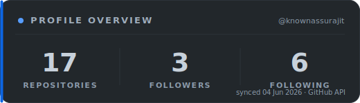
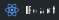
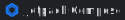

 

 
 

 
 

<!-- STATS_START -->
`18` repositories &nbsp;&middot;&nbsp; `3` followers &nbsp;&middot;&nbsp; `6` following
<!-- STATS_END -->

---

<h2>&nbsp; Profile</h2>

> **Business Intelligence & Database Engineer** with 3+ years designing, optimizing, and operating enterprise-grade data systems. Deep expertise in **PL/SQL, PostgreSQL, Oracle, and MySQL**, with hands-on command of ETL, data migration, cloud deployment, and performance tuning.
>
> Comfortable across Agile and DevOps workflows — building scalable and secure systems, driven by clean design and emerging tech (HCI, on-device AI, and sustainable software).

---

<h2>&nbsp; Tech Stack</h2>

   &nbsp;<b>Programming &amp; Databases</b>
   
  
  
  
  
  
  

   &nbsp;<b>DevOps &amp; Tooling</b>
   
  
  
  
  
  

   &nbsp;<b>Data &amp; BI</b>
   
  
  

   &nbsp;<b>Frontend &amp; Mobile</b>
   
  
  
  
  
  

   &nbsp;<b>Design</b>
   
  
  

---

<h2>&nbsp; Works</h2>

**Professional**

| Nº | Project | Domain |
| :-: | :-- | :-- |
| `01` | **Manufacturing KPI Platform** | Oracle SQL · Tableau · Power BI |
| `02` | **Supply Chain Risk DB** | PostgreSQL · PL/pgSQL · Python |
| `03` | **Core Banking Pipeline** | PostgreSQL · Oracle · BaNCS |

 

**Selected Projects**

| Project | What it is | Stack |
| :-- | :-- | :-- |
| **[impstr ↗](https://play.google.com/store/apps/details?id=com.game.impstr)** | Fast-paced, physics-based Android action game with custom canvas loops and vector physics. | Kotlin · Compose · Canvas |
| **[flora ↗](https://florabyjonakee.vercel.app/)** | Premium, minimalist e-commerce showcase for plant enthusiasts, with elegant animations and glass overlays. | React · Next.js · Tailwind |
| **[void ↗](https://github.com/knownassurajit/void)** | Lightweight Kotlin utility library — performance, custom operators, and boilerplate reduction for Android. | Kotlin · Android |
| **[gemini-nano-playground ↗](https://github.com/knownassurajit/gemini-nano-playground)** | On-device GenAI demo running Gemini Nano offline via the Chrome / Android Prompt API. | Kotlin · Gemini Nano |
| **[Escape-Launcher ↗](https://github.com/knownassurajit/Escape-Launcher)** | Minimalist, text-based Android launcher designed to reduce phone addiction. | Kotlin · Jetpack |

---

<h2>&nbsp; Journey</h2>

| Period | Role | Organization |
| :-- | :-- | :-- |
| Feb 2025 — Present | **Assistant Manager** | Bosch India |
| Nov 2024 — Jan 2025 | **Senior Database Engineer** | Adapt Ready |
| Oct 2021 — Nov 2024 | **Senior System Engineer** | Tata Consultancy Services |
| May 2021 — Oct 2021 | **Project Engineer** | Wipro |

 

**Selected impact**

- **Bosch India** — Led ETL development and Oracle SQL optimization for scalable BI; migrated dashboards and automated reporting pipelines, improving performance by ~30%.
- **Adapt Ready** — Built resilient data pipelines and shell-scripted backup automation, cutting manual database maintenance by ~80%.
- **TCS · BaNCS** — Engineered financial systems for BFSI clients; led a PostgreSQL → Oracle migration that improved retrieval speeds by ~25%.
- **Wipro · Alight Solutions** — Owned core database operations, performance tuning, and data-integrity assurance.

---

<h2>&nbsp; Certifications</h2>

| Certification | Focus |
| :-- | :-- |
| **Google IT Support** — Professional Certificate | OS administration, automation, security, troubleshooting |
| **Google UX Design** — Professional Certificate | UX research, wireframing, responsive design |
| **Machine Learning** — Stanford University | Data preparation, model building, evaluation |
| **Python Programming** — University of Michigan | Control structures, data types, functions |
| **Cybersecurity Tools & Cyber Attacks** — IBM | CIA triad, cryptography, incident response |

---

<h2>&nbsp; Education</h2>

| Institution | Programme | Years |
| :-- | :-- | :-- |
| **University of Engineering & Management, Jaipur** | B.Tech, Computer Science Engineering | 2017 — 2021 |
| **Umesh Chandra Basuhara Vidyalaya, Malda** | Higher Secondary — Computer Science | 2011 — 2017 |
| **Harishchandrapur High School, Malda** | Secondary — Science | 2009 — 2010 |

 

<i>Beyond the desk — guitarist & drummer, cricket and football, hackathons, and festival organizing.</i>

---

<h2>&nbsp; GitHub Activity</h2>

<table border="0" align="center" style="border: none; border-collapse: collapse; background: transparent;">
  <tr style="border: none; background: transparent;">
    <td align="center" style="border: none; padding: 5px; background: transparent;">
      
    </td>
    <td align="center" style="border: none; padding: 5px; background: transparent;">
      
    </td>
  </tr>
  <tr style="border: none; background: transparent;">
    <td align="center" colspan="2" style="border: none; padding: 5px; background: transparent;">
      
    </td>
  </tr>
</table>

 

Recent activity, refreshed every 12 hours via the GitHub API:

<!-- CONTRIB_START -->
<ul>
  <li>🔀 <b>Jun 21, 2026</b> &nbsp;Merged pull request #5 in <b>knownassurajit</b> &nbsp;&middot;&nbsp; <a href='https://github.com/knownassurajit/knownassurajit'>repo &#8599;</a></li>
  <li>🔀 <b>Jun 21, 2026</b> &nbsp;Closed pull request #73 in <b>void</b> &nbsp;&middot;&nbsp; <a href='https://github.com/knownassurajit/void'>repo &#8599;</a></li>
  <li>🔀 <b>Jun 21, 2026</b> &nbsp;Assigned pull request #75 in <b>void</b> &nbsp;&middot;&nbsp; <a href='https://github.com/knownassurajit/void'>repo &#8599;</a></li>
  <li>🔀 <b>Jun 21, 2026</b> &nbsp;Assigned pull request #10 in <b>knownassurajit</b> &nbsp;&middot;&nbsp; <a href='https://github.com/knownassurajit/knownassurajit'>repo &#8599;</a></li>
  <li>🔀 <b>Jun 21, 2026</b> &nbsp;Assigned pull request #6 in <b>knownassurajit</b> &nbsp;&middot;&nbsp; <a href='https://github.com/knownassurajit/knownassurajit'>repo &#8599;</a></li>
</ul>
<!-- CONTRIB_END -->

---

<h3>Let's build something.</h3>

Open to data engineering, business intelligence, and thoughtful product work.

 
 

KNOWNASSURAJIT // PROFILE_README · LAT 12.97&deg;N · LON 77.59&deg;E · &copy; 2026

