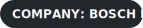

  

    <h1 class="title">👋 Hi, I'm Surajit Das</h1>
    
Assistant Manager @ Bosch India • Data Engineering • Backend Systems

    
    

      
      
      
    

  

  <h2 class="section-title">🎯 About Me</h2>
  

    I’m an <strong>Assistant Manager at Bosch India</strong> with 3+ years of experience in <strong>database engineering, ETL pipelines, and backend systems</strong>.
    I focus on delivering reliable data platforms with clean, user-friendly design principles inspired by <strong>Material Design for the web</strong>.
  

  <h2 class="section-title">💼 Professional Journey</h2>
  

    
<h3>🚀 Bosch India</h3>
<strong>Assistant Manager</strong> • Feb 2025 – Present
<ul><li>Leading ETL development and Oracle SQL optimization.</li><li>Automated BI reporting pipelines and KPI standardization.</li></ul>

    
<h3>🔍 Adapt Ready</h3>
<strong>Database Engineer</strong> • Nov 2024 – Jan 2025
<ul><li>Built robust data pipelines and automated backups.</li><li>Reduced manual database maintenance by 80%.</li></ul>

    
<h3>🛍️ Walmart Global Tech India</h3>
<strong>Backend Engineer</strong>
<ul><li>Built PL/SQL modules with CI/CD for real-time apps.</li><li>Improved performance with test-first DB workflows.</li></ul>

    
<h3>⚡ GE Renewables</h3>
<strong>Database Developer</strong>
<ul><li>Delivered PostgreSQL analytics solutions.</li><li>Supported process optimization with SQL insights.</li></ul>

    
<h3>🏛️ Tata Consultancy Services</h3>
<strong>PL/SQL Developer – TCS BaNCS</strong> • Oct 2021 – Nov 2024
<ul><li>Built financial systems for BFSI clients.</li><li>Migrated PostgreSQL to Oracle with faster retrieval.</li></ul>

    
<h3>💻 Wipro Limited</h3>
<strong>Backend Engineer – Alight Solutions</strong> • May 2021 – Oct 2021
<ul><li>Managed core DB operations and tuning.</li><li>Strengthened compliant infrastructure delivery.</li></ul>

  

  <h2 class="section-title">🧰 Tech Stack</h2>
  

    
<strong>Databases</strong> Oracle • PostgreSQL • MySQL

    
<strong>Backend</strong> PL/SQL • SQL • Python • Bash

    
<strong>Data Ops</strong> ETL • Migration • Tuning • Automation

    
<strong>UI/UX</strong> Material UI • Figma • UX Systems

  

  <h2 class="section-title">🏆 Certifications</h2>
  

    <ul>
      <li><strong>Google IT Support Professional Certificate</strong></li>
      <li><strong>Google UX Design Professional Certificate</strong></li>
      <li><strong>Machine Learning</strong> (Stanford University)</li>
      <li><strong>Python Programming</strong> (University of Michigan)</li>
      <li><strong>Cybersecurity Tools & Cyber Attacks</strong> (IBM)</li>
    </ul>
  

  <h2 class="section-title">📈 GitHub Live Dashboard</h2>
  

    

      
      
    

     
    
      
    
  

  <h2 class="section-title">🤝 Connect with Me</h2>
  

    
    
  

  
💡 Open to collaboration, data engineering opportunities, and meaningful conversations.

