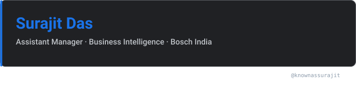
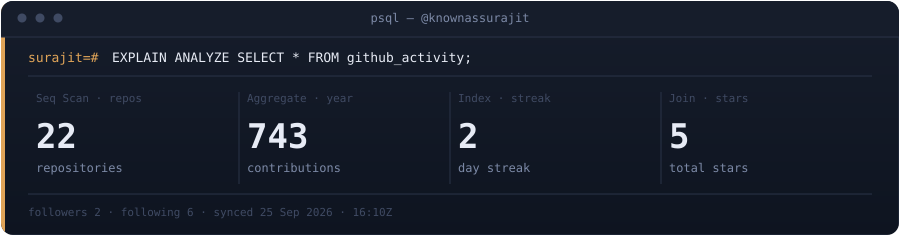
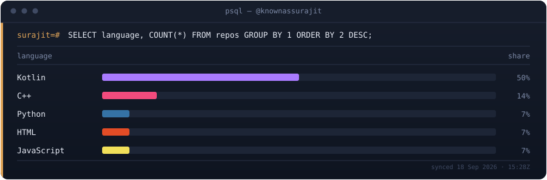
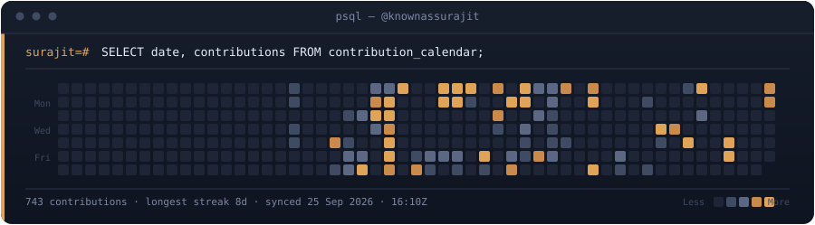

  

  

  

---

##  Profile

> **Business Intelligence & Database Engineer** with 3+ years designing, optimizing, and operating enterprise-grade data systems. Deep expertise in **PL/SQL, PostgreSQL, Oracle, and MySQL**, with hands-on command of ETL, data migration, cloud deployment, and performance tuning.
>
> Comfortable across Agile and DevOps workflows — building scalable and secure systems, driven by clean design and emerging tech (HCI, on-device AI, and sustainable software).

---

##  Stack

**Data**

**Engineering**

---

##  Works

**Professional**

| Nº | Project | Domain |
| :-: | :-- | :-- |
| `01` | **Manufacturing KPI Platform** | Oracle SQL · Tableau · Power BI |
| `02` | **Supply Chain Risk DB** | PostgreSQL · PL/pgSQL · Python |
| `03` | **Core Banking Pipeline** | PostgreSQL · Oracle · BaNCS |

**Public repositories** · refreshed every 12 hours via GitHub API

<!-- PROJECTS_START -->
| Project | Description | Stack | ★ |
| :-- | :-- | :-- | --: |
| **[impstr ↗](https://play.google.com/store/apps/details?id=com.game.impstr)** | Fast-paced physics-based Android action game with custom canvas loops. | Kotlin | 0 |
| **[clndr ↗](https://github.com/knownassurajit/clndr)** | Calendar utility built in Kotlin. | Kotlin | 0 |
| **[void ↗](https://github.com/knownassurajit/void)** | Lightweight Kotlin utility library — operators and Android boilerplate reduction. | Kotlin | 0 |
| **[rebyld ↗](https://github.com/knownassurajit/rebyld)** | Experimental rebuild / tooling project. | HTML | 0 |
| **[dvide ↗](https://github.com/knownassurajit/dvide)** | Kotlin project exploring structured UI and tooling. | Kotlin | 0 |
| **[limit-order-book ↗](https://github.com/knownassurajit/limit-order-book)** | Limit order book engine with matching and quantity checks. | C++ | 3 |
| **[calculator-application ↗](https://github.com/knownassurajit/calculator-application)** | High-performance calculator written in C++. | C++ | 1 |
| **[Editor.io ↗](https://code-web.vercel.app/)** | Online HTML/CSS/JS + Markdown editor. | — | 0 |
| **[realtime-facial-expression-recognition ↗](https://github.com/knownassurajit/realtime-facial-expression-recognition)** | FER-2013 realtime expression model (Keras · OpenCV · Flask). | Jupyter Notebook | 1 |
<!-- PROJECTS_END -->

---

##  Journey

| Period | Role | Organization |
| :-- | :-- | :-- |
| Feb 2025 — Present | **Assistant Manager** | Bosch India |
| Nov 2024 — Jan 2025 | **Senior Database Engineer** | Adapt Ready |
| Oct 2021 — Nov 2024 | **Senior System Engineer** | Tata Consultancy Services |
| May 2021 — Oct 2021 | **Project Engineer** | Wipro |

**Selected impact**

- **Bosch India** — Led ETL development and Oracle SQL optimization for scalable BI; migrated dashboards and automated reporting pipelines, improving performance by ~30%.
- **Adapt Ready** — Built resilient data pipelines and shell-scripted backup automation, cutting manual database maintenance by ~80%.
- **TCS · BaNCS** — Engineered financial systems for BFSI clients; led a PostgreSQL → Oracle migration that improved retrieval speeds by ~25%.
- **Wipro · Alight Solutions** — Owned core database operations, performance tuning, and data-integrity assurance.

---

##  Certifications

| Certification | Focus |
| :-- | :-- |
| **Google IT Support** — Professional Certificate | OS administration, automation, security, troubleshooting |
| **Google UX Design** — Professional Certificate | UX research, wireframing, responsive design |
| **Machine Learning** — Stanford University | Data preparation, model building, evaluation |
| **Python Programming** — University of Michigan | Control structures, data types, functions |
| **Cybersecurity Tools & Cyber Attacks** — IBM | CIA triad, cryptography, incident response |

---

##  Education

| Institution | Programme | Years |
| :-- | :-- | :-- |
| **University of Engineering & Management, Jaipur** | B.Tech, Computer Science Engineering | 2017 — 2021 |
| **Umesh Chandra Basuhara Vidyalaya, Malda** | Higher Secondary — Computer Science | 2011 — 2017 |
| **Harishchandrapur High School, Malda** | Secondary — Science | 2009 — 2010 |

<i>Beyond the desk — guitarist &amp; drummer, cricket and football, hackathons, and festival organizing.</i>

---

##  Activity

Recent activity, refreshed every 12 hours via the GitHub API:

<!-- CONTRIB_START -->
<ul>
  <li><b>Sep 03, 2026</b> &nbsp;Merged pull request #78 in <b>void</b> &nbsp;&middot;&nbsp; <a href='https://github.com/knownassurajit/void'>repo</a></li>
  <li><b>Sep 03, 2026</b> &nbsp;Merged pull request #14 in <b>knownassurajit</b> &nbsp;&middot;&nbsp; <a href='https://github.com/knownassurajit/knownassurajit'>repo</a></li>
  <li><b>Sep 03, 2026</b> &nbsp;Merged pull request #2 in <b>rebyld</b> &nbsp;&middot;&nbsp; <a href='https://github.com/knownassurajit/rebyld'>repo</a></li>
  <li><b>Sep 03, 2026</b> &nbsp;Assigned pull request #2 in <b>rebyld</b> &nbsp;&middot;&nbsp; <a href='https://github.com/knownassurajit/rebyld'>repo</a></li>
  <li><b>Sep 03, 2026</b> &nbsp;Merged pull request #20 in <b>impstr</b> &nbsp;&middot;&nbsp; <a href='https://github.com/knownassurajit/impstr'>repo</a></li>
</ul>
<!-- CONTRIB_END -->

---

<h3>Let's build something.</h3>

Open to data engineering, business intelligence, and thoughtful product work.

knownassurajit · synced via GitHub API · &copy; 2026

