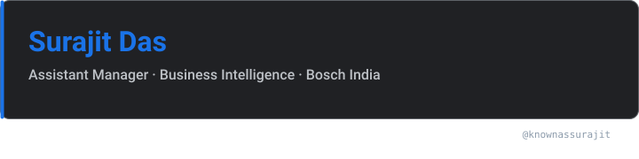
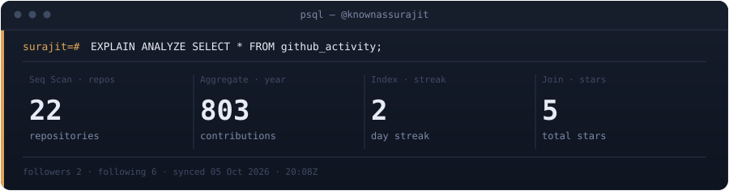
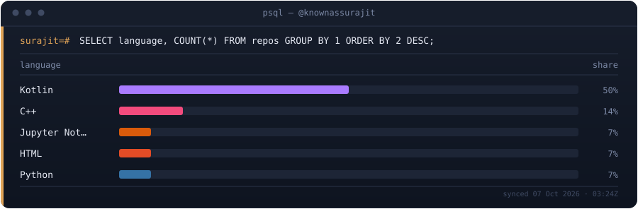
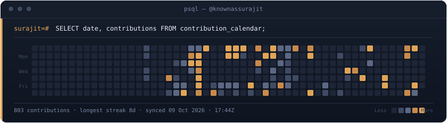

  

  

  

---

## Profile

> **Assistant Manager — BI & Database Engineering** at Bosch India (~6 years). I design and operate enterprise data platforms — **Oracle, PL/SQL, PostgreSQL, APEX, ETL, Azure** — and ship product work on the side: **Kotlin / Jetpack Compose** Android apps, **Next.js** storefronts, and **AI tooling** (GPT-4o, Copilot, prompt engineering).
>
> **Keywords:** Oracle · PL/SQL · PostgreSQL · Azure · CI/CD · Power BI · Kotlin · Jetpack Compose · Next.js · TypeScript · Prisma · Supabase · AI / LLM · open source
>
> **Featured builds:** [Flora](https://florabyjonakee.com) (jewellery e-commerce) · [Impstr](https://github.com/knownassurajit/impstr) (social-deduction Android) · [Void](https://github.com/knownassurajit/void) (minimalist Android launcher) · [Girly Tales](https://www.girlytales.in) · [clndr](https://github.com/knownassurajit/clndr) · [dvide](https://github.com/knownassurajit/dvide) / Cyclewise · [rebyld](https://github.com/knownassurajit/rebyld)

---

## Stack

**Data**

**Engineering**

---

## Works

**Professional**

| Nº | Project | Domain |
| :-: | :-- | :-- |
| `01` | **Manufacturing KPI Platform** | Oracle SQL · Tableau · Power BI |
| `02` | **LLM KPI / incident assistant** | GPT-4o · Azure Foundry · Azure DevOps |
| `03` | **Supply Chain Risk DB** | PostgreSQL · PL/pgSQL · Python |
| `04` | **Core Banking Pipeline** | PostgreSQL · Oracle · BaNCS |
| `05` | **Flora by Jonakee** | Next.js · Prisma · Supabase · Vercel |

**Public repositories** · refreshed every 12 hours via GitHub API

<!-- PROJECTS_START -->
| Project | Description | Stack | ★ |
| :-- | :-- | :-- | --: |
| **[impstr ↗](https://github.com/knownassurajit/impstr)** | Offline pass-and-play social deduction party game (Stealth Mode). | Kotlin · Compose | — |
| **[void ↗](https://github.com/knownassurajit/void)** | Radically minimalist text-based Android launcher to cut digital noise. | Kotlin · Compose | — |
| **[clndr ↗](https://github.com/knownassurajit/clndr)** | Minimal monochrome widget-first calendar — life grid, milestones, Glance. | Kotlin · Compose | — |
| **[dvide ↗](https://github.com/knownassurajit/dvide)** | Cyclewise — salary-cycle personal finance tracker (on-device). | Kotlin · Compose | — |
| **[rebyld ↗](https://github.com/knownassurajit/rebyld)** | Personal performance PWA — nutrition, workouts, hydration, recovery. | PWA · JS | — |
| **[gemini-nano-playground ↗](https://github.com/knownassurajit/gemini-nano-playground)** | On-device AI playground with Gemini Nano + Jetpack Compose. | Kotlin · Compose · AI | — |
| **[limit-order-book ↗](https://github.com/knownassurajit/limit-order-book)** | Limit order book engine with matching and quantity checks. | C++ · Python | — |
| **[Editor.io ↗](https://code-web.vercel.app/)** | Online HTML/CSS/JS + Markdown editor. | Web | — |
<!-- PROJECTS_END -->

---

## Journey

| Period | Role | Organization |
| :-- | :-- | :-- |
| Feb 2025 — Present | **Assistant Manager** | Bosch India |
| Nov 2024 — Jan 2025 | **Senior Database Engineer** | Adapt Ready |
| Oct 2021 — Nov 2024 | **Senior System Engineer** | Tata Consultancy Services |
| May 2021 — Oct 2021 | **Project Engineer** | Wipro |

**Selected impact**

- **Bosch India** — Led ETL development and Oracle SQL optimization for scalable BI; migrated dashboards and automated reporting pipelines, improving performance by ~30%.
- **Adapt Ready** — Built resilient data pipelines and shell-scripted backup automation, cutting manual database maintenance by ~80%.
- **TCS · BaNCS** — Engineered financial systems for BFSI clients; led a PostgreSQL → Oracle migration that improved retrieval speeds by ~25%.
- **Wipro · Alight Solutions** — Owned core database operations, performance tuning, and data-integrity assurance.

---

## Certifications

| Certification | Focus |
| :-- | :-- |
| **Google IT Support** — Professional Certificate | OS administration, automation, security, troubleshooting |
| **Google UX Design** — Professional Certificate | UX research, wireframing, responsive design |
| **Machine Learning** — Stanford University | Data preparation, model building, evaluation |
| **Python Programming** — University of Michigan | Control structures, data types, functions |
| **Cybersecurity Tools & Cyber Attacks** — IBM | CIA triad, cryptography, incident response |

---

## Education

| Institution | Programme | Years |
| :-- | :-- | :-- |
| **University of Engineering & Management, Jaipur** | B.Tech, Computer Science Engineering | 2017 — 2021 |
| **Umesh Chandra Basuhara Vidyalaya, Malda** | Higher Secondary — Computer Science | 2011 — 2017 |
| **Harishchandrapur High School, Malda** | Secondary — Science | 2009 — 2010 |

<i>Beyond the desk — guitarist &amp; drummer, cricket and football, hackathons, and festival organizing.</i>

---

## Activity

Recent activity, refreshed every 12 hours via the GitHub API:

<!-- CONTRIB_START -->
<ul>
  <li>No recent public activity.</li>
</ul>
<!-- CONTRIB_END -->

---

<h3>Let's build something.</h3>

Open to data engineering, business intelligence, and thoughtful product work.

knownassurajit · synced via GitHub API · &copy; 2026

